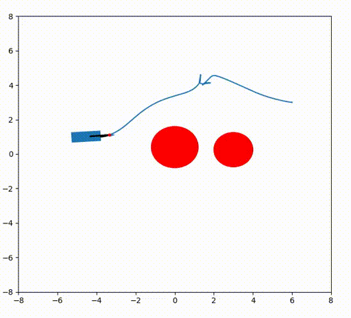

# Fabrics

[](https://github.com/maxspahn/fabrics/actions/workflows/diffGeo_agents.yml)
[](https://github.com/maxspahn/fabrics/actions/workflows/unitTest.yml)

Optimization fabrics can be used to formulate local motion planning in form of trees with various task definining leaves.
The work is based on findings in https://arxiv.org/abs/2008.02399 .

Point Robot             |  Planar Robot
:-------------------------:|:-------------------------:
 |  

Nonholonomic Robots
:-------------------------:


# IMPORTANT NOTE

SET THE VARIABLE `Jdot_sign` IN diffGeometry/variabLes TO `-1`.


## Tutorials

This repository contains brief examples corresponding to the theory presented in "Optimization Fabrics" by Ratliff et al.
https://arxiv.org/abs/2008.02399 .
These examples are named according to the naming in that publication. Each script is self-contained and required software is 
numpy, matplotlib.pyplot and casadi.

## Python Package

There is also a python package to be used to develop custom leaves.
# Dependencies
Beside some common packages, the examples depend on several custom packages.
They are installed using the pip installation.

# Installation

Install the package through pip, using 
```bash
pip3 install -r requirements.txt
pip3 install -e fabrics_package
```

## Gym Agents

Open-AI gym agents can be controlled using fabrics. Planar cases can be found in
gym_agents. They require the installation of 
[planarEnvs](https://gitlab.tudelft.nl/mspahn/planarenvs).

## Related works and websites
# websites
https://sites.google.com/nvidia.com/geometric-fabrics
# paper
https://arxiv.org/abs/2010.14750
https://arxiv.org/abs/2008.02399
https://arxiv.org/abs/2010.14745
https://arxiv.org/abs/2010.15676
https://arxiv.org/abs/1801.02854
# video
https://www.youtube.com/watch?v=aM9Ha2IawEo


## Time Variant (beta)

 
