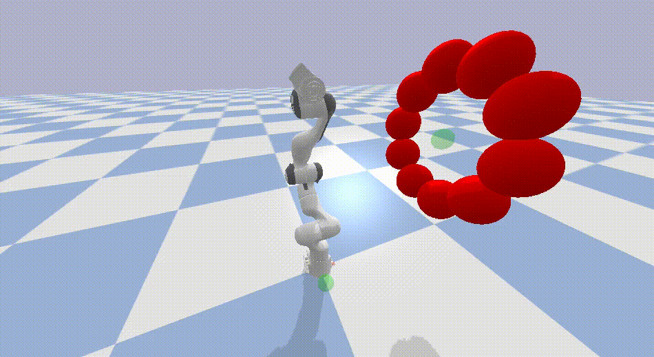
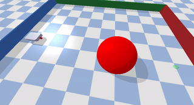
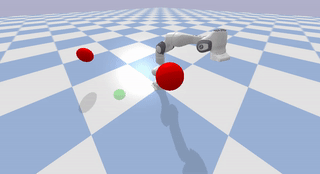
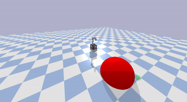

# (Geometric) Fabrics

[](https://github.com/maxspahn/fabrics/actions/workflows/diffGeo_agents.yml)
[](https://github.com/maxspahn/fabrics/actions/workflows/unitTest.yml)

**Note on development**
> This project is still under heavy development and there is a lack of
> documentation. I, @maxspahn, am committed to improve and maintain that package.
> However, I rely on people like you to point me to issues and unclear sections of
> the code. So feel free to leave issues whenever something bugs you.

**Fabrics ros-wrapper**
> The fabrics-ros wrapper will be released very shortly when compatibility is
> verified.


Geometric Fabrics represent a geometric approach to motion generation for
various robot structures. The idea is a next development step after Riemannian
Motion Policies and offers increased stability and accessibility.

<table>
  <tr>
    <td><b>Holonomic robots</b></th>
    <td><b>Non-Holonomic robots</b></th>
  </tr> 
  <tr>
    <td> </td>
    <td> </td>
  </tr> 
  <tr>
    <td> </td>
    <td> </td>
  </tr>
  <tr>
    <td> </td>
  </tr>
</table>


## Installation

Install the package through pip, using 
```bash
pip3 install ".<options>"
```
or from PyPI using
```bash
pip3 install fabrics
```
Options are [agents] and [tutorials]. Those can be installed using
```
pip3 install ".[agents]"
pip3 install ".[tutorials]"
```

Install the package through poetry, using
```bash
poetry install --with <option>
```

## Publications

This repository was used in several publications. The major one being
[Dynamic Optimization Fabrics for Motion Generation](https://arxiv.org/abs/2205.08454) 
If you are using this software, please cite:
```bash
@misc{https://doi.org/10.48550/arxiv.2205.08454,
  doi = {10.48550/ARXIV.2205.08454},
  url = {https://arxiv.org/abs/2205.08454},
  author = {Spahn, Max and Wisse, Martijn and Alonso-Mora, Javier},
  keywords = {Robotics (cs.RO), FOS: Computer and information sciences, FOS: Computer and information sciences},
  title = {Dynamic Optimization Fabrics for Motion Generation},
  publisher = {arXiv},
  year = {2022},
  copyright = {Creative Commons Attribution Share Alike 4.0 International}
}
```
Other publications where this repository was used:

https://github.com/maxspahn/optuna_fabrics
```bash
@article{https://doi.org/10.48550/arxiv.2302.06922,
  doi = {10.48550/ARXIV.2302.06922},
  url = {https://arxiv.org/abs/2302.06922},
  author = {Spahn, Max and Alonso-Mora, Javier},
  keywords = {Robotics (cs.RO), FOS: Computer and information sciences, FOS: Computer and information sciences},
  title = {Autotuning Symbolic Optimization Fabrics for Trajectory Generation},
  publisher = {arXiv},
  year = {2023},
  copyright = {Creative Commons Attribution Share Alike 4.0 International}
}
```

https://github.com/tud-amr/localPlannerBench
```bash
@misc{https://doi.org/10.48550/arxiv.2210.06033,
  doi = {10.48550/ARXIV.2210.06033},
  url = {https://arxiv.org/abs/2210.06033},
  author = {Spahn, Max and Salmi, Chadi and Alonso-Mora, Javier},
  keywords = {Robotics (cs.RO), FOS: Computer and information sciences, FOS: Computer and information sciences},
  title = {Local Planner Bench: Benchmarking for Local Motion Planning},
  publisher = {arXiv},
  year = {2022},
  copyright = {Creative Commons Attribution Share Alike 4.0 International}
}
```


## Tutorials

This repository contains brief examples corresponding to the theory presented
in "Optimization Fabrics" by Ratliff et al. https://arxiv.org/abs/2008.02399.
These examples are named according to the naming in that publication. Each
script is self-contained and required software is installed using 
```bash
pip install ".[tutorials]"
```
## Related works and websites

The work is based on some works by the NVIDIA Research Labs. Below you find a
list of all relevant links:

### lecture notes
- https://www.nathanratliff.com/pedagogy/mathematics-for-intelligent-systems#lecture6

### websites
- https://sites.google.com/nvidia.com/geometric-fabrics

### paper
- https://arxiv.org/abs/2010.14750
- https://arxiv.org/abs/2008.02399
- https://arxiv.org/abs/2010.14745
- https://arxiv.org/abs/2010.15676
- https://arxiv.org/abs/1801.02854

### videos and talks
- https://www.youtube.com/watch?v=aM9Ha2IawEo
- https://www.youtube.com/watch?v=awiF6JjDEbo
- https://www.youtube.com/watch?v=VsM-kdk74d8

