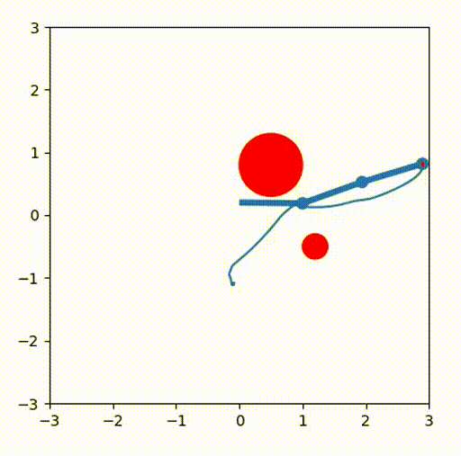
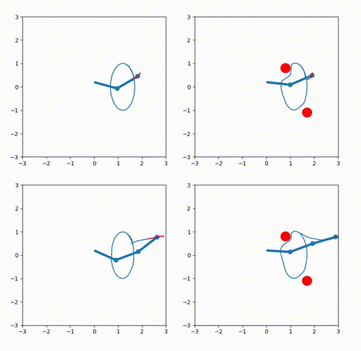

### Fabrics

Optimization fabrics can be used to formulate local motion planning in form of trees with various task definining leaves.
The work is based on findings in https://arxiv.org/abs/2008.02399 .

Point Robot             |  Planar Robot
:-------------------------:|:-------------------------:
 |  

## Tutorials

This repository contains brief examples corresponding to the theory presented in "Optimization Fabrics" by Ratliff et al.
https://arxiv.org/abs/2008.02399 .
These examples are named according to the naming in that publication. Each script is self-contained and required software is 
numpy, matplotlib.pyplot and casadi.

## Python Package

There is also a python package to be used to develop custom leaves.
Install the package through pip, using 
```bash
cd fabrics_package
pip3 install -e .
```

## Related works and websites
# websites
https://sites.google.com/nvidia.com/geometric-fabrics
# paper
https://arxiv.org/abs/2010.14750
https://arxiv.org/abs/2008.02399
https://arxiv.org/abs/2010.14745
https://arxiv.org/abs/2010.15676
https://arxiv.org/abs/1801.02854


## Time Variant (beta)

 
